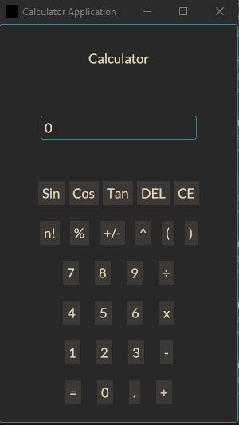
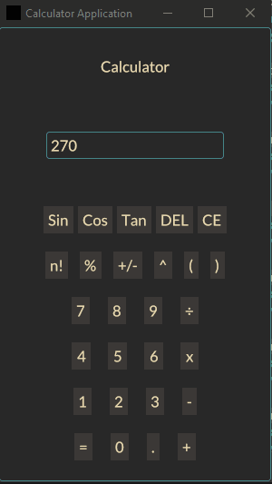
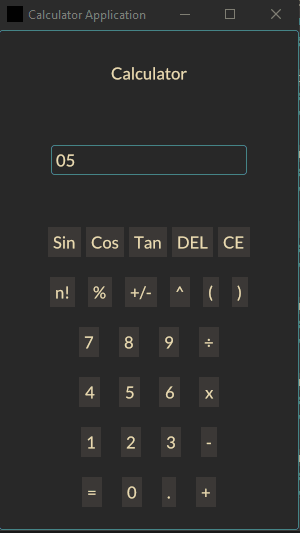
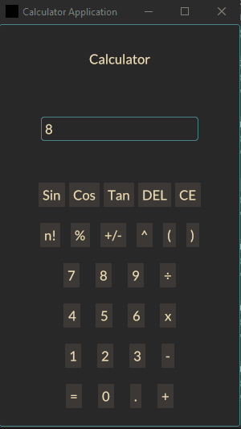
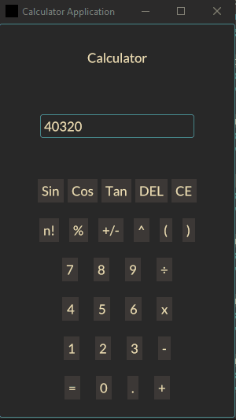

## A Simple Calculator Built with Iced GUI Library and Rust

Here is a simple calculator built with the [Iced GUI Library](https://github.com/iced-rs/iced) and [Rust](https://github.com/rust-lang/rust)!

#### Screenshots:

_Figure 1: Addition operation_

_Figure 2: Multiplication operation_

_Figure 3: Division operation_

_Figure 4: Sin operation_

_Figure 5: Factorial operation_

_Figure 6: DEL and CE operation_